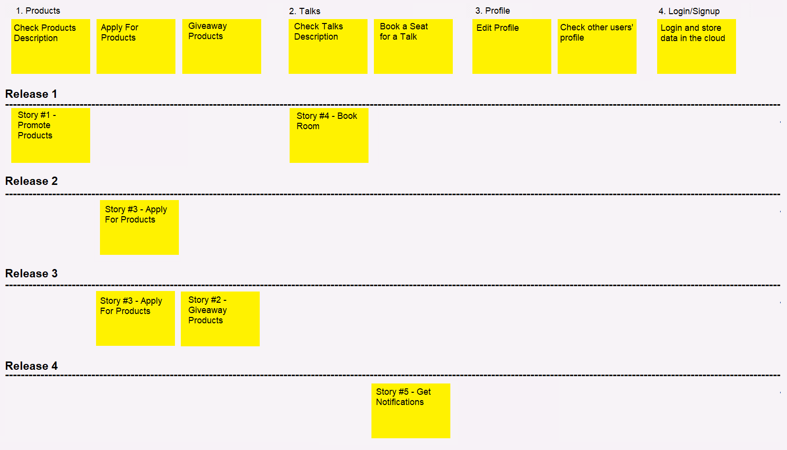
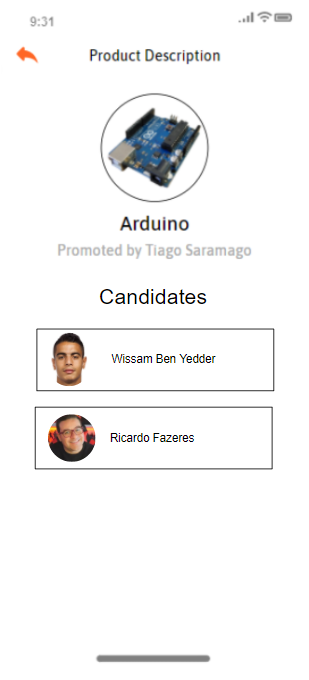

- # openCX-*t2g5-5headers* Development Report

  Welcome to the documentation pages of the ConfMate of **openCX**!

  So far, contributions are exclusively made by the initial team, but we hope to open them to the community, in all areas and topics: requirements, technologies, development, experimentation, testing, etc.

  Please contact us!

  Thank you!

  Carlos Lousada

  José David Rocha

  Tiago Marques

  Tomás Mendes

  ------

  ## Product Vision

  ConfMate is an app designed to redefine giveaways on conferences. Instead of relying on luck, we allow conference hosts to select who they want to give/sell the products to, based on requeriments they set.

  ------

  ## Elevator Pitch

  Most conferences have a common problem: products promoted by the hosts are often given away randomly and, most of the times, the attendees that receive them don't even give much use to them. That’s the reason why we decided to create ConfMate, an app designed to redefine conferences' giveaways. This way, instead of purely relying on luck, ConfMate allows hosts to select who they want to give or sell the products to, based on requirements they previously set. With our safe and reliable app, ConfMate will definitely make justice to conferences' giveaways.

  ------

  ## Requirements

  ### Use case diagram

  

  #### Book Products
  **Actor**: Attendee
  **Description**: By selecting a product from a given conference they can apply for the given product. Additionally, they can also fill out a small text, explaining the reason why they think they are a good match for the product.

  **Preconditions and Post conditions**: The user must be logged in order to book a product.

  **Normal flow**

  - The attendee navigates to the Products Tab.
  - The attendee taps on the product he wishes to apply to.

  - The attendee presses the button to apply for a product.
  - The attendee types why he should receive the product.
  - The attendee confirms his appliance.

  **Alternative Flows and Exceptions**

  - The attendee navigates to a Talk description.
  - The attendee taps the "Check Promoted Products" button.
  - The attendee taps on the product he wishes to apply to.

  - The attendee presses the button to apply for a product.
  - The attendee types why he should receive the product.
  - The attendee confirms his appliance.

  #### Promote Products
  **Actor:** Host  
  **Description:** The hosts can choose to promote products on their own talks as well as choosing the receivers of such products.

  **Preconditions and Post conditions**: The host must have created at least one talk in order to complete the adding of a product.

  **Normal flow:**

  - The host presses the button to add a product to his talk.
  - The host fills out a small form with the product description.
  - The hosts selects the talk which he wants to add the product to.

  #### Giveaway Products

  **Actor:** Host  
  **Description:** The hosts can choose the attendees who will receive the products.
  **Normal flow:**

  - The hosts navigates to the Products Tab.
  - The hosts taps on the product he wishes to check.

  - The host presses the button to check the candidates of his product.
  - The host scrolls through the list of attendees and selects who he wants to give the product to.
  - The hosts checks if the attendee selected is the one he wants to give the product to, by reading the text the attendee wrote with the justification for applying.
  - The hosts presses "YES" and gives the product to the attendee.

  **Alternative Flows and Exceptions:**

  - The hosts taps on his Talk.
  - The hosts taps on the "Check Promoted Products".
  - The host taps on the product he wishes to check.

  - The host presses the button to check the candidates of his product.
  - The host scrolls through the list of attendees and selects who he wants to give the product to.
  - The hosts checks if the attendee selected is the one he wants to give the product to, by reading the text the attendee wrote with the justification for applying.
  - The hosts presses "YES" and gives the product to the attendee.

  ---

  ### User Stories

    

  #### **Story #1 - Promote Products**

  As a host I want to be able to promote and recommend products I find relevant to the conference.

  _User interface mockups_

  
  

  _Acceptance Tests_

  ```gherkin
  Scenario: Promoting/recommending products on the conference
  	Given that I wish to promote/recommend a certain product I find relevant
  	When I tap the "Add Products" button
  	Then the app starts displaying the selected product on the conference's forum
  ```

  _Value/Effort_

  Value: Must have

  Effort: XL

  ---

  #### **Story #2 - Giveaway Prodcuts**

  As a host I want to be able to choose which attendees I wish to giveaway the products to.

  _User interface mockups_

  

  _Acceptance Tests_

  ```gherkin
  Scenario: Choosing which attendees should receive the products
  	Given that I wish to choose which attendees should receive the products
  	When I tap the "Choose Attendees" button
  	Then I will able be to pick between the candidates who I want to give the products to
  ```

  _Value/Effort_

  Value: Must have

  Effort: XL

  ---
  #### **Story #3 - Apply For Products**

  As an attendee I want to be able to apply for products.

  _User interface mockups_

  

  _Acceptance Tests_

  ```gherkin
  Scenario: Applying a product related to a certain conference
  	Given that I wish to apply for a promoted producted
  	When I tap the "Apply for" button
  	Then I will able be to the possible candidates capable of receiving the selected product
  ```

  _Value/Effort_

  Value: Must have

  Effort: XL

  ---
  #### **Story #4 - Book Room**

  As a host I want to be able to book a room to host my conference.

  _User interface mockups_

  

  _Acceptance Tests_
  ```gherkin
  Scenario: Booking a room to host a conference
  	Given that I wish to book a room to host my conference
  	When I click "Book Room"
  	Then the app shows me the available rooms 
  	When I tap the "Choose Room" button
  	Then the app books the selected room
      When I tap the "Create Talk" button
  	Then the system creates the conference and displays it on the "All Talks" menu
  ```
  _Value/Effort_

  Value: Must Have

  Effort: S

  ---
  #### **Story #5 - Book Seat**

  As an attendee I want to be able to book a seat for conferences that I wish to attend.

  _User interface mockups_

  

  _Acceptance Tests_
  ```gherkin
  Scenario: Booking a seat for a conference
  	Given I want to book a seat for a certain conference
  	When I click the "Book conference seat" button
  	Then the app shows me the available seats
  	When I click the "Select Seat"
  	Then the app books the seat for the selected conference
  ```
  _Value/Effort_

  Value: Must Have

  Effort: M

  ---

  #### **Story #6 - Get Notifications**

  As an attendee I want to be able to receive a notification whenever i receive (or don't receive) a product.
  
  _User interface mockups_
  
  

  _Acceptance Tests_

  ```gherkin
  Scenario: Getting a Notification
  	Given I want to get a product
  	When the Hosts gives me the product
  	Then the app sends me a notification
  ```
  
  _Value/Effort_
  
  Value: Must Have
  
  Effort: M
  
  ### Domain Model
  
  
  
  Our app concepts are easily understood, consisting of talks, products and profiles. 
  Every user profile can be connected to a talk as an attendee or host and can also apply for products, justifying his option on this subject. Furthermore, talks have limited seats and featured products that will be given away by the host to attendees that chose the products that he is promoting.
  
  ---
  ## Architecture and Design
  
  The architecture of a software system encompasses the set of key decisions about its overall organization. This way, logical and physical architectures are two main themes that will be covered in this specific topic.
  
  ### Logical architecture


  


  To structure our app on a high-level, we decided to implement the MVC architectural pattern, since it is a good standard for this type of project.

  Firstly, the Model contains all the application data: profiles, talks and products.

  Furthermore, the View component represents the concrete display of the app state (mainly composed by widgets).

  Finally, the Controller connects both previously referred components: the Model sends data for the View to display and the View sends user inputs for the Model to process. This process is completed using a set of objects that query the database (firestore), provide authentication functions, accept products, book seats, among other actions.

  ### Physical architecture


  

  The user installs ConfMate on their smartphone and whenever they need to connect with our database (firestore), it communicates with it via HTTPS requests, storing and retrieving all the information needed.

  Discussing about the programming language we chose, Flutter was the best concrete option, because of two main issues: it was not only required but also very appealing due to many provided built-in features.
