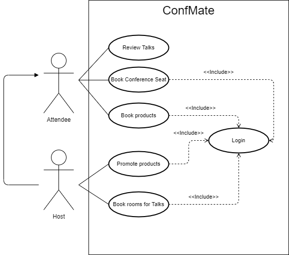
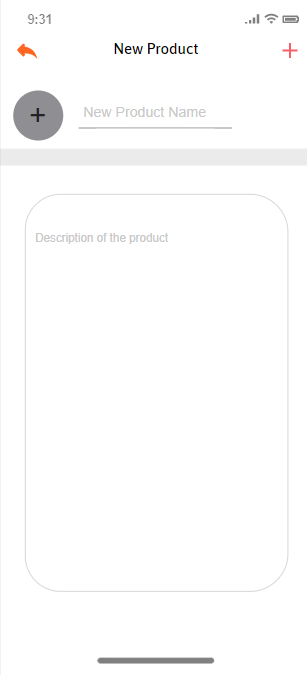
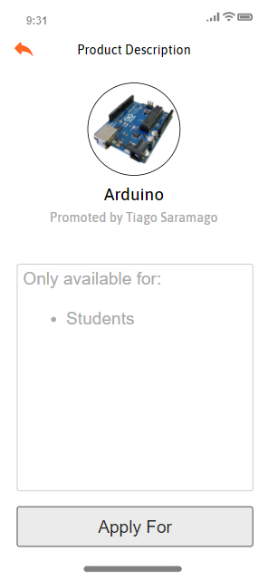
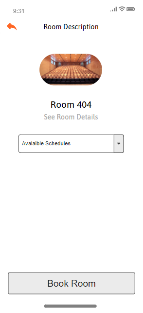
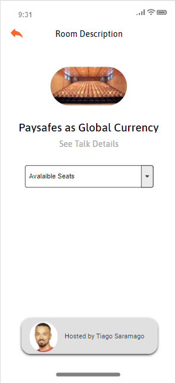

# openCX-*t2g5-5headers* Development Report

Welcome to the documentation pages of the ConfMate of **openCX**!

You can find here detailed about the ConfMate hereby mentioned as module, from a high-level vision to low-level implementation decisions, a kind of Software Development Report (see [template](https://github.com/softeng-feup/open-cx/blob/master/docs/templates/Development-Report.md)), organized by discipline (as of RUP):

- Business modeling
  - [Product Vision](https://github.com/open-cx/open-cx/blob/master/docs/templates/Development-Report.md#Product-Vision)
  - [Elevator Pitch](https://github.com/open-cx/open-cx/blob/master/docs/templates/Development-Report.md#Elevator-Pitch)
- Requirements
  - [Use Case Diagram](https://github.com/open-cx/open-cx/blob/master/docs/templates/Development-Report.md#Use-case-diagram)
  - [User stories](https://github.com/open-cx/open-cx/blob/master/docs/templates/Development-Report.md#User-stories)
  - [Domain model](https://github.com/open-cx/open-cx/blob/master/docs/templates/Development-Report.md#Domain-model)
- Architecture and Design
  - [Logical architecture](https://github.com/open-cx/open-cx/blob/master/docs/templates/Development-Report.md#Logical-architecture)
  - [Physical architecture](https://github.com/open-cx/open-cx/blob/master/docs/templates/Development-Report.md#Physical-architecture)
  - [Prototype](https://github.com/open-cx/open-cx/blob/master/docs/templates/Development-Report.md#Prototype)
- [Implementation](https://github.com/open-cx/open-cx/blob/master/docs/templates/Development-Report.md#Implementation)
- [Test](https://github.com/open-cx/open-cx/blob/master/docs/templates/Development-Report.md#Test)
- [Configuration and change management](https://github.com/open-cx/open-cx/blob/master/docs/templates/Development-Report.md#Configuration-and-change-management)
- [Project management](https://github.com/open-cx/open-cx/blob/master/docs/templates/Development-Report.md#Project-management)

So far, contributions are exclusively made by the initial team, but we hope to open them to the community, in all areas and topics: requirements, technologies, development, experimentation, testing, etc.

Please contact us!

Thank you!

Carlos Lousada

José David Rocha

Tiago Marques

Tomás Mendes

------

## Product Vision

ConfMate is an app designed to redefine giveaways on conferences. Instead of relying on luck, we allow conference hosts to select who they want to give/sell the products to, based on requeriments they set.

------

## Elevator Pitch

Most conferences have a common problem: products promoted by the hosts are often given away randomly and, most of the times, the attendees that receive them don't even give much use to them. That’s the reason why we decided to create ConfMate, an app designed to redefine conferences' giveaways. This way, instead of purely relying on luck, ConfMate allows hosts to select who they want to give or sell the products to, based on requirements they previously set. With our safe and reliable app, ConfMate will definitely make justice to conferences' giveaways.

------

## Requirements

### Use case diagram



#### Book Products
**Actor**: Attendee
**Description**: By selecting a product from a given conference they can apply for the given product. Additionally, they can also fill out a small text, explaining the reason why they think they are a good match for the product.
**Normal flow**:  The attendee the product and then writes a small text with the reason behind applying for the given product.

#### Promote Products
**Actor:** Host  
**Description:** The hosts can choose to promote products on their own talks as well as choosing the receivers of such products.
**Normal flow:** The host selects the product we wants to promote/chooses an attendee to receive the product.

---

### User Stories

#### **Story #1 - Promote Products**

As a host I want to be able to promote and recommend products I find relevant to the conference.

_User interface mockups_




_Acceptance Tests_

```gherkin
Scenario: Promoting/recommending products on the conference
	Given that I wish to promote/recommend a certain product I find relevant
	When I tap the "Add Products" button
	Then the app starts displaying the selected product on the conference's forum
```

_Value/Effort_

Value: Must have

Effort: XL

---

#### **Story #2 - Giveaway Prodcuts**

As a host I want to be able to choose which attendees I wish to giveaway the products to.

_User interface mockups_


_Acceptance Tests_

```gherkin
Scenario: Choosing which attendees should receive the products
	Given that I wish to choose which attendees should receive the products
	When I tap the "Choose Attendees" button
	Then I will able be to pick between the candidates who I want to give the products to
```

_Value/Effort_

Value: Must have

Effort: XL

---
#### **Story #3 - Apply For Products**

As an attendee I want to be able to apply for products.

_User interface mockups_



_Acceptance Tests_

```gherkin
Scenario: Applying a product related to a certain conference
	Given that I wish to apply for a promoted producted
	When I tap the "Apply for" button
	Then I will able be to the possible candidates capable of receiving the selected product
```

_Value/Effort_

Value: Must have

Effort: XL

---
#### **Story #4 - Book Room**

As a host I want to be able to book a room to host my conference.

_User interface mockups_



_Acceptance Tests_
```gherkin
Scenario: Booking a room to host a conference
	Given that I wish to book a room to host my conference
	When I click "Book Room"
	Then the app shows me the available rooms 
	When I tap the "Choose Room" button
	Then the app books the selected room
    When I tap the "Create Talk" button
	Then the system creates the conference and displays it on the "All Talks" menu
```
_Value/Effort_

Value: Must Have

Effort: S

---
#### **Story #5 - Book Seat**

As an attendee I want to be able to book a seat for conferences that I wish to attend.

_User interface mockups_



_Acceptance Tests_
```gherkin
Scenario: Booking a seat for a conference
	Given I want to book a seat for a certain conference
	When I click the "Book conference seat" button
	Then the app shows me the available seats
	When I click the "Select Seat"
	Then the app books the seat for the selected conference
```
_Value/Effort_

Value: Must Have

Effort: M

### Domain Model


Our app concepts are easily understood, consisting of talks, products and profiles. 
Every user profile can be connected to a talk as an attendee or host and can also apply for products, justifying his option on this subject. Furthermore, talks have limited seats and featured products that will be given away by the host to attendees that chose the products that he is promoting.

---
## Architecture and Design

The architecture of a software system encompasses the set of key decisions about its overall organization. This way, logical and physical architectures are two main themes that will be covered in this specific topic.

### Logical architecture


To structure our app on a high-level, we decided to implement the MVC architectural pattern, since it is a good standard for this type of project.

Firstly, the Model contains all the application data: profiles, talks and products.

Furthermore, the View component represents the concrete display of the app state (mainly composed by widgets).

Finally, the Controller connects both previously referred components: the Model sends data for the View to display and the View sends user inputs for the Model to process. This process is completed using a set of objects that query the database (firestore), provide authentication functions, accept products, book seats, among other actions.

### Physical architecture


The user installs ConfMate on their smartphone and whenever they need to connect with our database (firestore), it communicates with it via HTTPS requests, storing and retrieving all the information needed.

Discussing about the programming language we chose, Flutter was the best concrete option, because of two main issues: it was recommended by our teachers, while also seeming very appealing due to many provided built-in features.

### Prototype

To help on validating all the architectural, design and technological decisions made, we usually implement a vertical prototype, a thin vertical slice of the system.

In this subsection please describe in more detail which, and how, user(s) story(ies) were implemented.

------

## Implementation

Regular product increments are a good practice of product management.

While not necessary, sometimes it might be useful to explain a few aspects of the code that have the greatest potential to confuse software engineers about how it works. Since the code should speak by itself, try to keep this section as short and simple as possible.

Use cross-links to the code repository and only embed real fragments of code when strictly needed, since they tend to become outdated very soon.

------

## Test

There are several ways of documenting testing activities, and quality assurance in general, being the most common: a strategy, a plan, test case specifications, and test checklists.

In this section it is only expected to include the following:

- test plan describing the list of features to be tested and the testing methods and tools;
- test case specifications to verify the functionalities, using unit tests and acceptance tests.

A good practice is to simplify this, avoiding repetitions, and automating the testing actions as much as possible.

------

## Configuration and change management

Configuration and change management are key activities to control change to, and maintain the integrity of, a project’s artifacts (code, models, documents).

For the purpose of ESOF, we will use a very simple approach, just to manage feature requests, bug fixes, and improvements, using GitHub issues and following the [GitHub flow](https://guides.github.com/introduction/flow/).

------

## Project management

Software project management is an art and science of planning and leading software projects, in which software projects are planned, implemented, monitored and controlled.

In the context of ESOF, we expect that each team adopts a project management tool capable of registering tasks, assign tasks to people, add estimations to tasks, monitor tasks progress, and therefore being able to track their projects.

Example of tools to do this are:

- [Trello.com](https://trello.com/)
- [Github Projects](https://github.com/features/project-management/com)
- [Pivotal Tracker](https://www.pivotaltracker.com/)
- [Jira](https://www.atlassian.com/software/jira)

We recommend to use the simplest tool that can possibly work for the team.

------

## Evolution - contributions to open-cx

Describe your contribution to open-cx (iteration 5), linking to the appropriate pull requests, issues, documentation.

<details class="details-reset details-overlay details-overlay-dark" id="jumpto-line-details-dialog" style="box-sizing: border-box; display: block;"><summary data-hotkey="l" aria-label="Jump to line" role="button" style="box-sizing: border-box; display: list-item; cursor: pointer; list-style: none;"></summary></details>


- © 2020 GitHub, Inc.
- [Terms](https://github.com/site/terms)
- [Privacy](https://github.com/site/privacy)
- Cookie Preferences
- [Security](https://github.com/security)
- [Status](https://githubstatus.com/)
- [Help](https://docs.github.com/)
- [Contact GitHub](https://github.com/contact)
- [Pricing](https://github.com/pricing)
- [API](https://docs.github.com/)
- [Training](https://services.github.com/)
- [Blog](https://github.blog/)
- [About]
